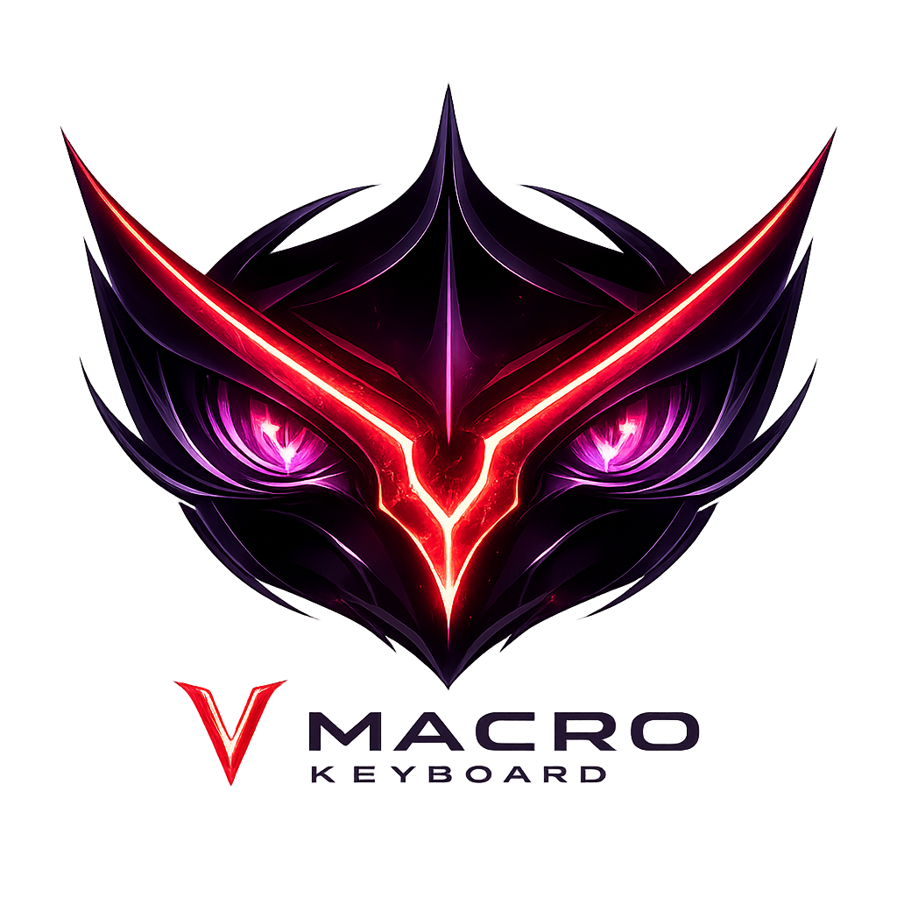

<p align="center">
  
</p>

<h1 align="center">V Macro Keyboard</h1>

<p align="center">
  Raccourcis globaux, navigation multi-fenêtres et séquences clavier/souris pour Windows.
  Pensé en particulier pour le confort des joueurs de Dofus.
</p>

<p align="center">
  <a href="https://github.com/chems647/V-Macro-Keyboard/actions/workflows/build.yml">
    
  </a>
  <a href="https://github.com/chems647/V-Macro-Keyboard/releases">
    
  </a>
</p>

## Installation

1. Ouvrez la page [Releases](https://github.com/chems647/V-Macro-Keyboard/releases/latest).
2. Téléchargez `VMacroKeyboard-Setup-x.y.z.exe`.
3. Lancez l’installateur puis ouvrez **V Macro Keyboard** depuis le menu Démarrer.

L’installation est faite uniquement pour l’utilisateur Windows courant et ne demande pas les droits administrateur. Une archive portable est également proposée dans chaque release.

Le programme n’est pas encore signé avec un certificat commercial. Windows SmartScreen peut donc demander une confirmation au premier lancement ; les sommes de contrôle SHA-256 publiées avec chaque version permettent de vérifier le téléchargement.

## Fonctionnalités

- Navigation cyclique entre les fenêtres Windows sélectionnées.
- Raccourcis clavier globaux avec `Ctrl`, `Alt`, `Maj` et `Windows`.
- Clics enregistrés à une position relative ou précise dans une fenêtre.
- Application d’un même clic à plusieurs fenêtres sélectionnées du même logiciel.
- Déclencheurs sur le clavier, le bouton du milieu et les boutons latéraux de la souris.
- Séquences comme `Espace, Ctrl+V, Entrée`, avec délai réglable entre les actions.
- Fenêtre cible enregistrée pour chaque séquence, même avec plusieurs écrans ou fenêtres Dofus.
- Profils portables et sauvegarde automatique.
- Interrupteur global pour suspendre immédiatement les raccourcis.

## Utilisation avec Dofus

V Macro Keyboard facilite notamment le passage entre plusieurs fenêtres Dofus et les actions répétitives déclenchées manuellement. L’application agit uniquement sur les entrées Windows : elle ne lit pas la mémoire du jeu, ne modifie pas ses fichiers et ne prend aucune décision à la place du joueur.

Les règles des jeux et services pouvant évoluer, chaque utilisateur reste responsable de la manière dont il configure ses raccourcis et doit vérifier les conditions applicables à son usage.

## Premiers pas

1. Cochez les fenêtres entre lesquelles vous souhaitez naviguer.
2. Choisissez la **Touche de bascule** (`F8` par défaut).
3. Pour un clic, choisissez une fenêtre, une touche, puis sélectionnez **Montrer le point**.
4. Pour une séquence, choisissez un déclencheur et saisissez les actions séparées par des virgules.
5. Utilisez **Enregistrer** pour créer un profil portable.

Exemple Dofus pour ouvrir le chat, coller une position puis la valider :

```text
Espace, Ctrl+V, Entrée
```

## Profils et migration

La sauvegarde automatique se trouve dans :

```text
%LOCALAPPDATA%\VMacroKeyboard\autosave.vmacro.json
```

Lors du premier lancement, une ancienne sauvegarde de MacroFenêtre est détectée et migrée automatiquement. Les anciens fichiers `*.macrofenetre.json` peuvent toujours être chargés.

## Développement

Prérequis : SDK .NET 10 sous Windows.

```powershell
dotnet build .\MacroFenetre.csproj --configuration Release
dotnet test .\tests\MacroFenetre.Tests\MacroFenetre.Tests.csproj --configuration Release
.\publish.ps1
```

Les tags Git `v*` déclenchent automatiquement la création de l’installateur, de l’archive portable et des sommes de contrôle SHA-256 dans une release GitHub.

## Identité

Le nom **V Macro Keyboard** est un clin d’œil personnel à l’esthétique stratégique de Code Geass. Ce projet est indépendant, n’utilise aucun élément officiel de la franchise et n’est affilié ni à ses ayants droit, ni à Ankama, ni à Dofus.
